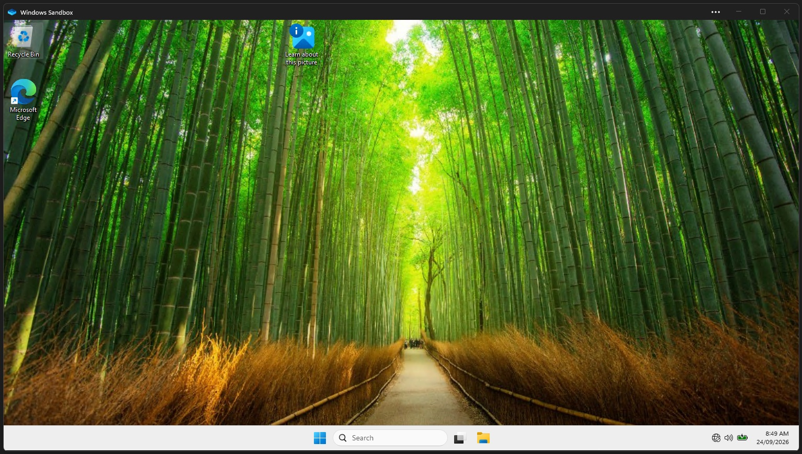
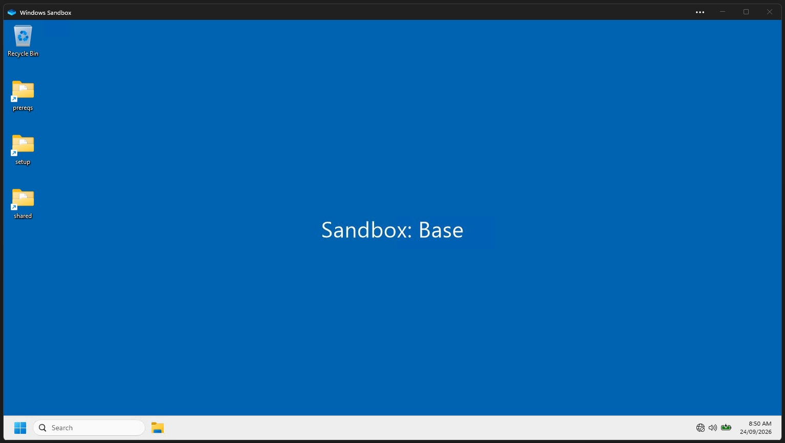

# Windows Sandbox

A set of scripts and config for starting a clean, disposable Windows desktop to try out installs,
upgrades and tests without touching the host machine.

[Windows Sandbox](https://learn.microsoft.com/windows/security/application-security/application-isolation/windows-sandbox/)
starts a new, lightweight Windows image each time and throws it away when the window closes. This
project adds:

- a **launch config** (`.wsb`) that maps host folders into the sandbox and turns off networking and
  device redirection;
- a **base setup script** that runs at logon and makes the desktop quick to work with (shortcuts to the
  mapped folders, a tidy taskbar, a wallpaper naming the scenario);
- a **scenario pattern**, so each testing job can build on the base setup with its own script;
- **timing logs** written back to the host, so you can see what happened inside a sandbox that no
  longer exists.

Because every run starts from the same clean image, results can be repeated: if something works in
the sandbox, it worked on a fresh Windows install with only what you gave it.

## What it looks like

| When the sandbox first opens | After the base setup script runs |
|---|---|
| [](docs/Screenshot_Initial.jpg) | [](docs/Screenshot_Base.jpg) |
| The stock Windows Sandbox desktop: default wallpaper, Edge shortcut, centred taskbar. | A few seconds later: a plain blue wallpaper naming the scenario, shortcuts to the `prereqs`, `setup` and `shared` folders, no Edge shortcut, and a left-aligned taskbar without Task View. |

Click either image to see it at full size.

## Layout

```
windows-sandbox\
├─ docs\                  Screenshots used in this README
├─ setup\                 Launch config and setup scripts (read-only inside the sandbox)
│  ├─ SandboxBase.wsb     Double-click to start the base sandbox
│  └─ SetupBase.ps1       Runs at logon: desktop, taskbar, wallpaper, logging
├─ prereqs\               Installers and fonts to use inside the sandbox (read-only inside)
│  └─ README.md           Commonly useful downloads
├─ logs\                  One timing log per sandbox run (read/write)
└─ shared\                Two-way exchange folder: packages, test files (read/write)
```

## Requirements

- Windows 10/11 Pro or Enterprise with the **Windows Sandbox** feature turned on
  (*Turn Windows features on or off* → *Windows Sandbox*, then reboot).
- This folder at `C:\source\solo\windows-sandbox`. The folder mappings in `SandboxBase.wsb` use that absolute path.

## Quick start

1. Put any installers you need in `prereqs\`. The sandbox has **no network**, so everything must be
   downloaded on the host first. See `prereqs\README.md` for common ones.
2. Double-click `setup\SandboxBase.wsb`, or run:

   ```powershell
   WindowsSandbox.exe C:\source\solo\windows-sandbox\setup\SandboxBase.wsb
   ```

3. Wait for the blue **Sandbox: Base** desktop. The setup script runs automatically at logon.
4. Copy anything you want to keep into `C:\sandbox\shared` before closing the window. Everything else
   is discarded.

Only one sandbox can run at a time.

## The base sandbox

| | |
|---|---|
| Desktop | Plain blue wallpaper labelled **Sandbox: &lt;Scenario&gt;**, icons auto-arranged from the top left |
| Shortcuts | `shared`, `setup` and `prereqs` on the desktop; the Edge shortcut is removed |
| Taskbar | Left-aligned, buttons never combined, Task View hidden |
| Recycle Bin | Asks for confirmation before deleting |
| Resources | 8 GB RAM, no vGPU, no audio/video input, no printers |
| Clipboard | Shared with the host |
| Network | **Disabled** |

### Folder mappings

| Host | In the sandbox | Access | Use it for |
|---|---|---|---|
| `setup\` | `C:\sandbox\setup` | read-only | The `.wsb` config and setup scripts |
| `prereqs\` | `C:\sandbox\prereqs` | read-only | Installers, fonts and other dependencies |
| `logs\` | `C:\sandbox\logs` | read/write | Logs written by the setup scripts |
| `shared\` | `C:\sandbox\shared` | read/write | Moving your own files in and out |

Only `logs\` and `shared\` survive the sandbox closing.

Scripts can't write to `setup\` or `prereqs\`. Anything that needs a writable copy (for example, an
installer that writes a log next to itself) has to be copied somewhere like `$env:TEMP` first.

## Logs

Each sandbox run writes `logs\SetupBase-<yyyyMMdd-HHmmss>.log`, which you can read on the host
once the desktop is up:

```
SetupBase (Base) - 2026-09-24 08:56:34

Sandbox boot -> PowerShell start   104,115 ms
PowerShell start -> script start    24,353 ms

Taskbar registry                        91 ms
Remove Edge shortcut                    39 ms
...

Script total                         2,422 ms
```

The first two lines show how long the sandbox takes to reach the script. The rest are the time for
each setup step. If a step fails, the log is still written, with a
`FAILED in step '<name>': <error>` line at the end. If the desktop doesn't look right, check this
log first.

## Adding a scenario

For a sandbox set up for a particular job, create `setup\Setup<Scenario>.ps1`. It should start by
calling the base setup, so the desktop gets the shared layout and a wallpaper with the scenario name:

```powershell
& "$PSScriptRoot\SetupBase.ps1" -Scenario '<Scenario>'
# scenario-specific installs go here, reading installers from C:\sandbox\prereqs
```

Then copy `SandboxBase.wsb` to `Sandbox<Scenario>.wsb` and point its `<LogonCommand>` at the new
script. So far there's only the base scenario.

## Git

`.gitignore` keeps the contents of `prereqs\`, `logs\` and `shared\` out of source control. It also
excludes installers, archives, certificates and keys, log files, Windows folder metadata
(`Thumbs.db`, `desktop.ini`) and editor settings anywhere in the tree. Only the scripts, the `.wsb`
file, the READMEs, the licence, the screenshots and the placeholder files are versioned.

## Licence

[MIT](LICENSE)
